# DSH // 天命 · 黑神话悟空皮肤

DeepSeek Harness Web GUI 的原创主题皮肤：以《黑神话：悟空》的墨黑与老金为基调，
把「天命人」映射为可见的 agent 化身。**仅供本人自用**，非官方 franchise 联名，
不含任何游戏原始素材（角色画面为原创/AI 生成，游戏名仅作主题致意）。

一切呈现均来自产品真实 DOM 证据驱动的五态状态机（问道 / 岔路 / 降妖 / 受创 / 功成），
不伪造任何进度。

## 预览

| 新会话封面（冷月，舞台隐藏） | 问道态（会话中，冷月背景） | 执行态（降妖，余烬背景+挥棍姿势） |
| --- | --- | --- |
| 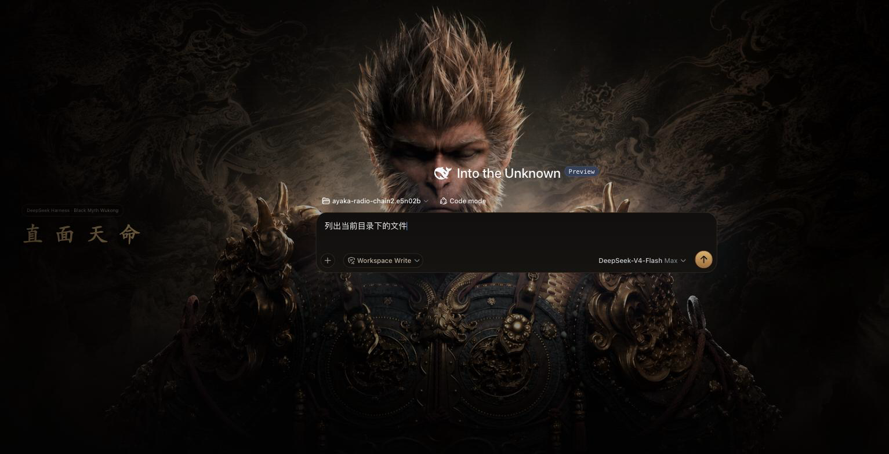 | 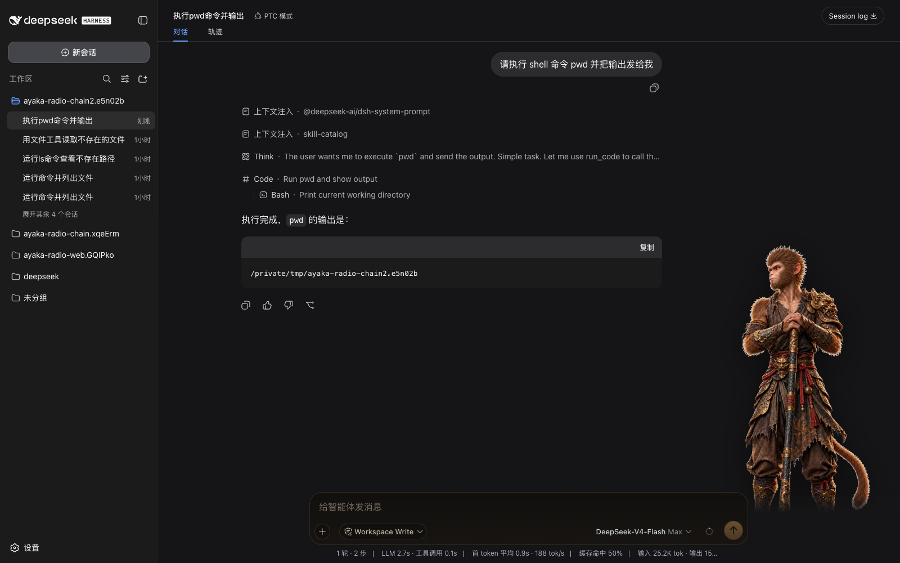 | 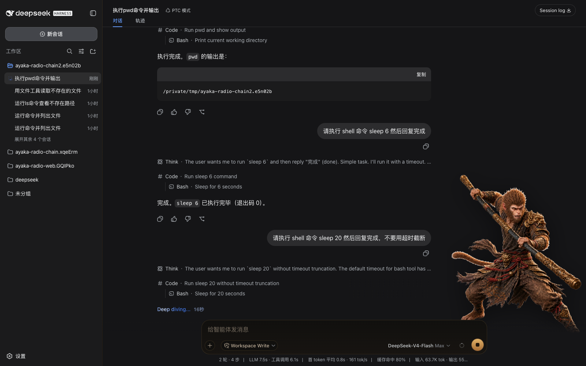 |

| 旧会话（历史错误不误报） | 卸载后恢复原生 |
| --- | --- |
| 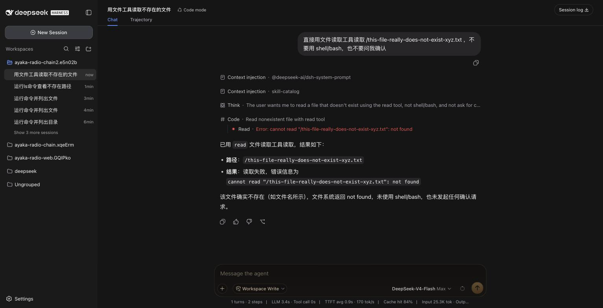 | 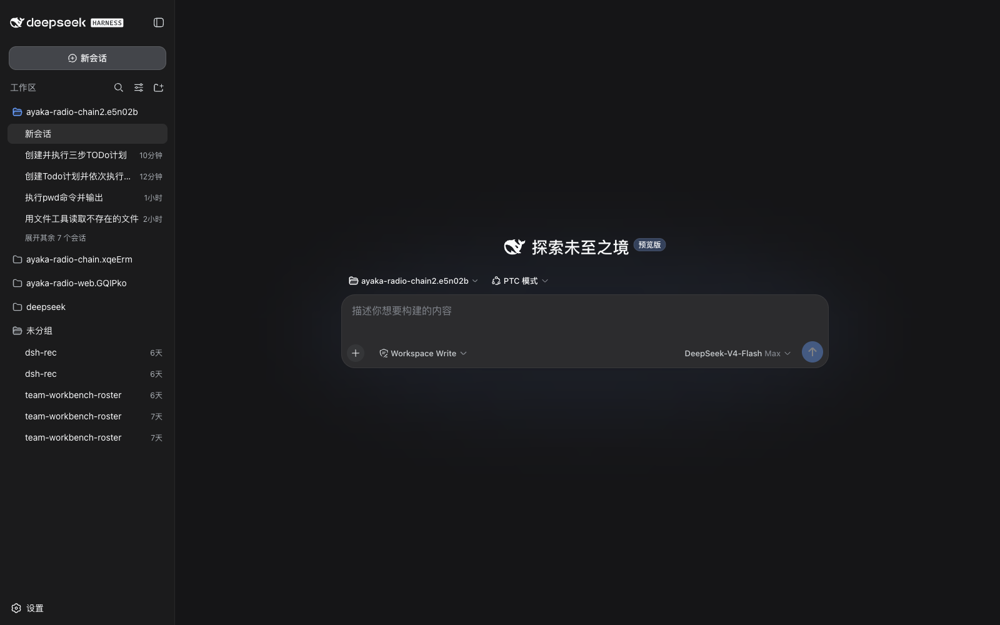 |

### 四档响应式舞台

| ≥1440px 全身 | 1024–1439px 半身 | 768–1023px 胸像 | <768px 名牌头像 |
| --- | --- | --- | --- |
| 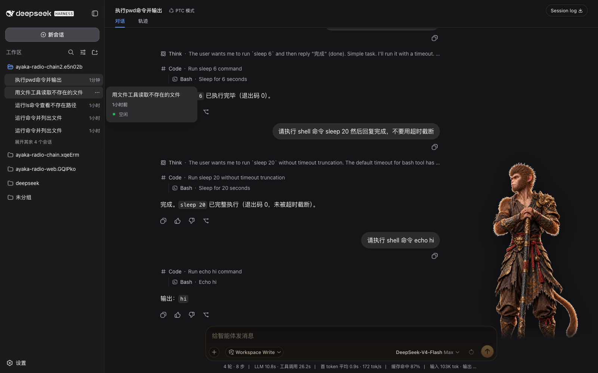 | 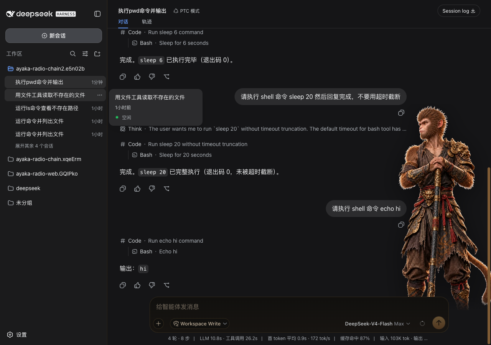 | 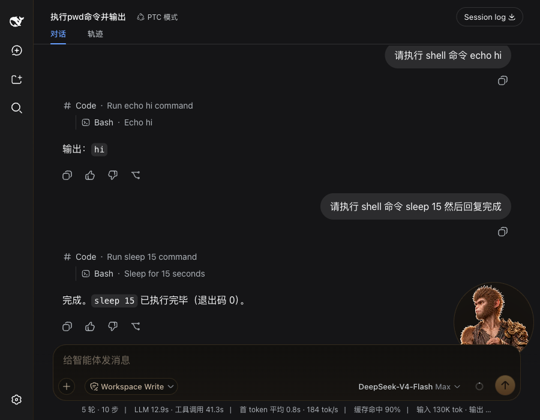 | 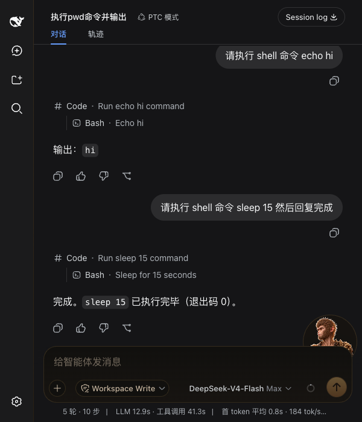 |

### P2 新增呈现

| 棍势 HUD（降妖，招式名+连击珠） | 岔路签文（choice 退暗+签文卡） | 披挂条（点击→原生模型菜单） |
| --- | --- | --- |
| 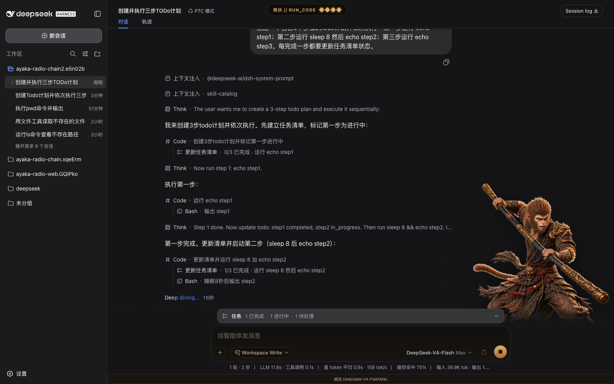 | 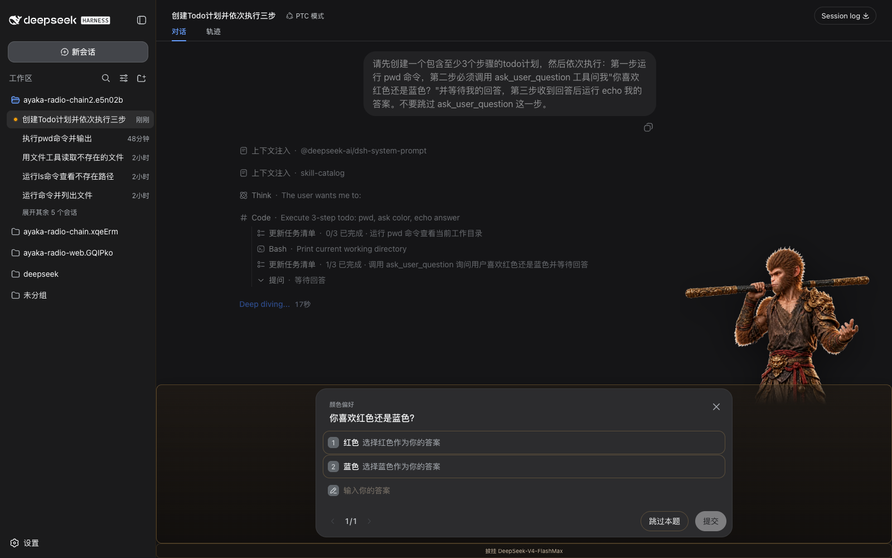 | 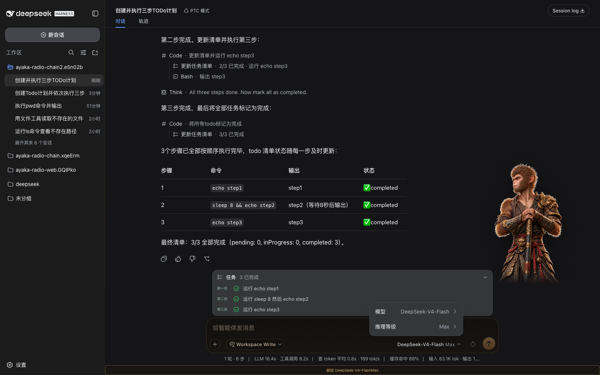 |

| 章回 todo（第一回…回目编号） | 影神图 trajectory（纸纹+行分级左边线） |
| --- | --- |
| 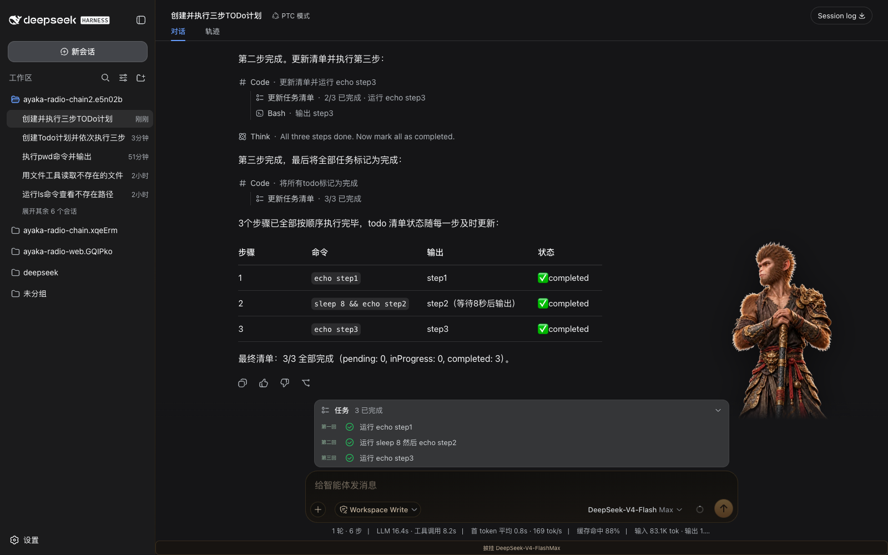 | 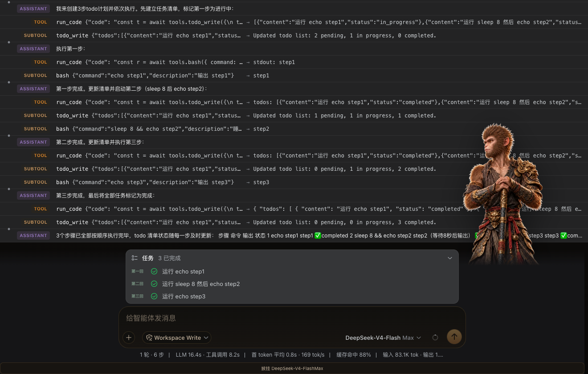 |

## 安装

```sh
pnpm install
pnpm build
dsh plugin --profile web add -w /path/to/dsh-wukong
```

卸载（恢复原生标题 / favicon / 背景 / body 属性）：

```sh
dsh plugin --profile web remove @dsh-external/dsh-wukong
```

> 一个 dsh web 实例同一时间只应启用一个 `ui-skin-*` 皮肤插件。两个皮肤
> 插件同时安装会互相争抢同一套 DOM 观测/写入逻辑，实测会导致页面主线程
> livelock（完全卡死，DevTools 也无法执行任何脚本）。若本机已装有其他
> 皮肤（如 dsh-afterglow），请先卸载它再安装本皮肤。

## P0/P1 状态

P0、P1 均已完成（骨架 + 可安装 + 五态状态机 + New Session 封面 + 角色舞台 + 场景双光照 +
水墨转场 + 真机 playtest）：

- 骨架：`contract.ts` 五态状态机（含历史错误基线，重载旧会话不会误报"受创"）、
  `--wk-*` token、New Session 封面页（"直 面 天 命"）。
- 角色舞台：`stage.ts` 五态立绘双层交叉淡入淡出，四档响应式（≥1440 全身 /
  1024–1439 半身 / 768–1023 胸像 / <768 名牌头像），空会话时舞台隐藏。
- 场景双光照：问道/岔路=冷月版背景，降妖/受创=余烬版背景，随 `data-wukong-state`
  切换。
- 水墨转场：`vfx.ts` 一次性 620ms 墨晕特效，状态切换时播放，reduced-motion 下不播。
- 美术资产处理：由 `art-production/` 原图经 cwebp 压缩为 `assets-gen/*.webp` 内嵌，
  `art.generated.ts` 由 `tools/embed-assets.mjs` 自动生成，无需手动改动。
- 真机 playtest（Playwright MCP 驱动本机 dsh web GUI）：会话中立绘/背景随真实工具调用
  状态切换、四档响应式实测、卸载→刷新→全还原→重装恢复全链路验证通过；胸像/名牌头像档
  的圆形裁切窗通过 `transform: scale` 二次放大聚焦头部（P1 用裁切顶数，专门胸像半身图
  留给 P3）。

## P2 状态

P2 已完成（棍势连击 HUD + 岔路签文 + 披挂条 + 章回 todo + 影神图 trajectory），
真机 playtest 见 `.superpowers/sdd/2026-08-25-dsh-wukong-p2/task-6-report.md`：

- 棍势 HUD：`hud.ts` 仅 battle/alert 可见的顶部胶囊，招式名 + 四珠连击条，数据全部
  来自 `readBattleTelemetry` 对 `[data-chat-flow]` 工具行的真实读数（ok 累计、error
  清零、running 行取招式名），无假分母。真机验证：HUD 随工具执行实时刷新、珠数随
  真实 ok 行累积、label 随当前工具切换。
- 岔路签文：`[data-question-key]`/`[data-plan-review-key]`/`[data-approval-key]`
  卡片描边+渐变质感，触发时 `[data-chat-flow]` 退暗（opacity 0.55），选项
  `:focus-visible` 金色描边；纯 CSS 皮肤层，不克隆任何提交入口，原生点击/键盘
  Tab+Enter 提交路径完全未改动。真机用一个必然触发 `ask_user_question` 的任务验证
  通过（退暗生效、卡片质感生效、Tab 焦点环为 `--wk-gold2`、原生"提交"按钮点击后
  正常进入下一状态）。
- 披挂条：`loadout.ts` 在 composer 座位内渲染只读 chip，点击只转发原生模型触发器
  `.click()`，不做任何克隆提交；1.5s 轮询兜底 + mutation observer 双路刷新。真机
  验证：点击 chip 确实打开产品原生"模型/推理等级"菜单，原生菜单换挡（Off/High/
  Max）后 chip 文案在 1.5s 内（实测为下一次 DOM 变更即时触发，远快于轮询上限）刷新。
  **已知缺陷**（逻辑问题，未在本任务修复，见 task-6-report.md）：产品原生模型触发器
  的模型名与推理等级分别渲染在两个无分隔文本的 `<span>` 里（`textContent` 直接拼接
  为 `DeepSeek-V4-FlashMax`，分隔符只存在于触发器的 `title` 属性），导致
  `stanceFor()` 的"棍势三式"从未在 chip 上显示——chip 目前只显示拼接后的模型名，
  丢失棍势后缀。单元测试因 mock DOM 把分隔符写进了同一个文本节点而未捕获此问题。
- 章回 todo：`[data-testid='todo-panel'] li[data-status]` 前缀"第N回"（CJK 数字
  计数器），进行中=`--wk-ember`、完成=`--wk-jade`。真机验证：真实 3 步 todo 计划
  执行全程回目编号与灯色随 `data-status` 变化（completed 呈现为 jade；in-progress
  ember 色通过 computed style 直接验证）。
- 影神图 trajectory：`[data-trajectory-scroll]` 卷轴纸纹渐变，`[data-timeline-span]`
  内 user/tool/subtool 三类分级左边线（金/古铜/浅古铜），`[data-error='true']` 转红。
  真机验证：真实 trajectory 页各字段 computed style 均匹配设计值；该边线画在顶部
  8px 高的迷你时间条上，视觉上是细节强调而非大面积色块，属设计既有形态。
- **已知问题（P1 遗留，非本轮引入，未修复）**：768px 以下"名牌头像"档舞台头像
  （固定于 `right:8px; bottom:88px`）在产品原生 todo 面板（`[data-testid=
  'todo-panel']`）展开于 composer 上方时，会与发送按钮视觉重叠。P1 playtest 未覆盖
  "composer 上方有 todo 面板"这一真实场景，故未被发现；stage 定位 CSS 不在本轮
  P2 任务范围内，留待后续任务处理。
- P3（棍势特效 VFX / 定身术 Stop 呈现 / 专门胸像美术）不在本轮范围内。

## 开发

```sh
pnpm test    # vitest，7 个测试文件、50 条用例（contract/cover/apply/stage/vfx/hud/loadout）
pnpm build   # tsdown 构建 lib/（node 入口 + client bundle）
```

> dsh 插件 bundle 变更后需重启 `dsh --profile web` 进程才生效（无热重载）。

## 许可

自用项目，不对外分发。
